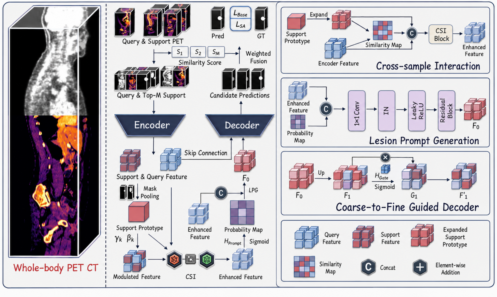
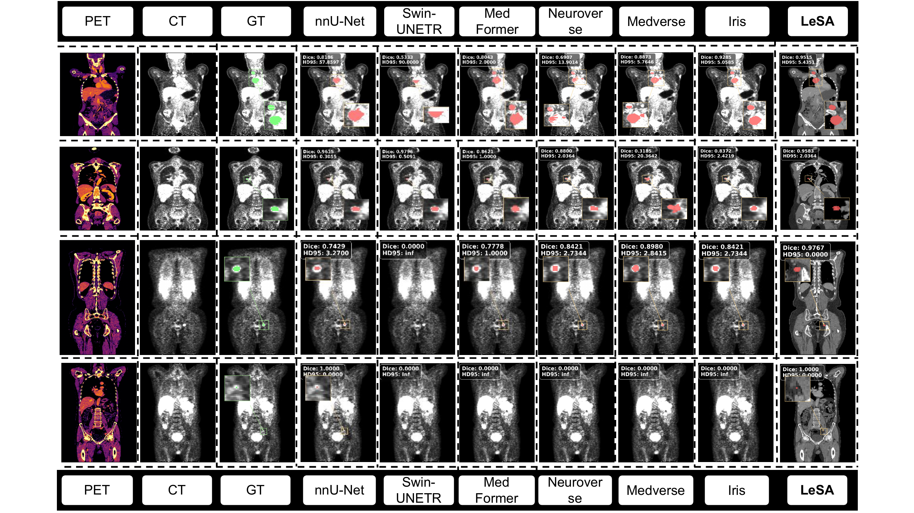

# LeSANet

## Lesion-Set-Aware In-Context Learning for Whole-Body PET-CT Tumor Segmentation

LeSANet is a 3D lesion-aware in-context learning framework for segmenting multiple metastatic lesions in whole-body PET-CT. Instead of compressing support cases into a single task-level representation, LeSANet explicitly models lesion-set-level correspondence between support and query volumes. The framework is designed for heterogeneous, spatially dispersed, small, and low-contrast lesions.

> Paper status: AAAI 2026 anonymous submission. Citation information will be added after the paper is publicly available.

## Highlights

- Retrieval-enhanced lesion prior construction selects metabolically relevant support cases.
- Support prototype conditioning transfers lesion semantics while suppressing background responses.
- Cross-sample interaction anchors lesion prototypes to potential query locations.
- Lesion-guided prompts and a coarse-to-fine gated decoder preserve small-lesion information.
- Similarity-weighted multi-support fusion combines complementary predictions.
- A size-aware loss increases the optimization contribution of small lesions.
- Experiments cover AutoPET-FDG, AutoPET-PSMA, and DeepPSMA.

## Method

Given a PET-CT query and a fixed pool of labeled training cases, LeSANet first ranks support candidates using PET metabolic similarity. The top-$M$ supports are encoded together with the query. Lesion prototypes are extracted by masked pooling, used to condition the query representation, and spatially aligned through cross-sample interaction. The decoder then performs lesion-prompted coarse-to-fine refinement. Candidate predictions are fused using the query-support similarity scores.



The main components are:

1. **Lesion Prior Construction (LPC)**
   - **Support Retrieval (SR):** builds PET hotspot descriptors and retrieves metabolically similar support cases.
   - **Support Prototype Conditioning (SPC):** extracts lesion prototypes by masked average pooling and modulates query features.
2. **Cross-Sample Interaction (CSI)**
   - Computes a spatial similarity map between the conditioned query feature and the support prototype.
   - Transfers lesion semantics from each support to likely lesion locations in the query.
3. **Lesion-Guided Segmentation Refinement (LSR)**
   - Generates a coarse lesion prompt.
   - Applies coarse-to-fine gated decoding.
   - Fuses multiple support-conditioned predictions using similarity-weighted softmax.
4. **Size-Aware Loss**
   - Reweights connected lesion components according to volume.
   - Improves supervision for small and sparse lesions that contribute few voxels to standard overlap losses.

## Repository Structure

```text
LeSA-Net/
├── assets/
│   ├── lesanet_architecture.png      # Method overview
│   └── qualitative_results.png       # Qualitative comparison
├── data/
│   └── episodic_loader.py            # NIfTI registry, patch sampling, augmentation
├── docs/
│   ├── lesanet_aaai2026_submission.pdf
│   ├── lesanet_architecture.pdf
│   └── qualitative_results.pdf
├── evaluation/
│   └── metrics.py                    # Dice, PPV, sensitivity, and HD95
├── models/
│   ├── encoder_3d.py                 # Shared 3D residual encoder
│   └── lesa_model.py                 # LeSANet model implementation
├── training/
│   └── episodic_trainer.py           # Episodic training and validation loop
├── utils/
│   └── losses.py                     # Base segmentation losses and metrics
├── loss.py                           # Size-aware loss
├── train.py                          # Training entry point
├── test.py                           # Evaluation/inference entry point
└── README.md
```

## Datasets

### AutoPET-FDG

AutoPET-FDG contains 1,014 whole-body $^{18}$F-FDG PET-CT studies acquired at the University Hospital of Tuebingen: 501 studies with malignant melanoma, lymphoma, or lung cancer and 513 negative controls. Lesions were manually annotated in 3D.

- NIfTI dataset: [FDG-PET-CT-Lesions on FDAT](https://fdat.uni-tuebingen.de/records/wf9fy-txq84)
- DICOM dataset: [TCIA collection DOI](https://doi.org/10.7937/gkr0-xv29)
- Data descriptor: [Scientific Data, 2022](https://doi.org/10.1038/s41597-022-01718-3)

### AutoPET-PSMA

AutoPET-PSMA contains 597 pre-treatment and post-treatment PSMA PET-CT studies from 378 patients with suspected or diagnosed prostate cancer. The scans were acquired on three Siemens and GE systems using $^{18}$F-PSMA and $^{68}$Ga-PSMA-11 tracers. The manuscript experiments include 537 studies with PSMA-avid lesions and 60 without lesions.

- NIfTI dataset: [PSMA-PET-CT-Lesions on FDAT](https://fdat.uni-tuebingen.de/records/g27kx-86t35)
- DICOM dataset: [PSMA-PET-CT-Lesions on TCIA](https://www.cancerimagingarchive.net/collection/PSMA-PET-CT-Lesions/)
- Data descriptor: [Scientific Data, 2026](https://doi.org/10.1038/s41597-026-07821-z)

### DeepPSMA

DeepPSMA contains paired PSMA and FDG PET-CT studies from 100 patients with metastatic castration-resistant prostate cancer before $^{177}$Lu-PSMA therapy. It provides tracer-specific tumor burden annotations. PSMA masks use an SUV threshold of at least 3 with manual removal of physiological uptake; FDG masks use an adaptive liver-based threshold.

- Full NIfTI dataset: [Zenodo record 15281784](https://doi.org/10.5281/zenodo.15281784)
- Dataset description: [autoPET V / DeepPSMA](https://autopet-v.grand-challenge.org/datasets/)

Please read and follow the license and access conditions of each source dataset.

### Preprocessing

The paper uses the following preprocessing:

1. Convert PET intensities to standardized uptake values (SUV).
2. Resample PET and CT to isotropic resolution.
3. Clip CT intensities to $[-100, 200]$ HU.
4. Apply volume-wise Z-score normalization independently to PET and CT.
5. Use lesion-centered 3D patches during episodic training.

The current loader performs lesion-centered crop/pad, per-channel Z-score normalization, and random axis flips. It **does not** perform DICOM conversion, SUV conversion, isotropic resampling, or CT HU clipping. Complete these steps before using the released loader.

### Expected Data Layout

The loader expects nnU-Net-style NIfTI filenames. PET is channel `0000` and CT is channel `0001`.

```text
DATA_ROOT/
├── imagesTr/
│   ├── case_0001_0000.nii.gz         # PET
│   ├── case_0001_0001.nii.gz         # CT
│   ├── case_0002_0000.nii.gz
│   └── case_0002_0001.nii.gz
├── labelsTr/
│   ├── case_0001.nii.gz              # Binary lesion mask
│   └── case_0002.nii.gz
└── split.json
```

The current code reads `train` and `val` keys:

```json
{
  "train": ["case_0001", "case_0002", "case_0003"],
  "val": ["case_0101", "case_0102", "case_0103"]
}
```

Each split must contain at least two usable lesion-positive cases. With `skip_negative_samples: true`, cases with empty masks are removed.

### Split Principle Used in the Paper

Splitting is performed at the **patient level** so that all scans from one patient remain in the same subset.

1. Divide each dataset into two disjoint cohorts, $A$ and $B$, of approximately equal size.
2. Split cohort $A$ into $A_{train}:A_{val}=8:2$.
3. Split cohort $B$ into $B_{train}:B_{val}:B_{test}=4:2:4$.
4. Train the in-context model on $A_{train}$, validate on $A_{val}$, and evaluate on the held-out $B_{test}$.
5. Draw all annotated support cases from $A_{train}$. Never use a validation/test image or annotation as a support case.
6. Use a fixed support pool of eight labeled training volumes and retrieve the top two supports for each query.

For the fully supervised upper bounds reported in the paper, models are trained on $A_{train}\cup B_{train}$, validated on $B_{val}$, and tested on $B_{test}$.

> **Reproducibility note:** the current `test.py` creates both queries and support candidates from the `val` loader. For a strict reproduction of the paper protocol, adapt the evaluator so that queries come from the held-out evaluation split while support candidates are loaded only from the fixed training support pool.

## Environment

The following dependency stack has been verified with the released code:

| Component | Version |
|---|---:|
| Python | 3.8.20 |
| PyTorch | 2.4.1 |
| CUDA runtime used by PyTorch | 11.8 |
| cuDNN | 9.1.0 |
| NumPy | 1.24.3 |
| SciPy | 1.10.1 |
| NiBabel | 5.2.1 |
| PyYAML | 6.0.2 |

An NVIDIA GPU with CUDA support is recommended. The manuscript does not specify the training GPU model or GPU memory, so hardware requirements may vary with patch size and support-pool size.

### Installation

```bash
git clone https://github.com/wuchangw/LeSA-Net.git
cd LeSA-Net

conda create -n lesanet python=3.8.20 -y
conda activate lesanet

pip install torch==2.4.1 --index-url https://download.pytorch.org/whl/cu118
pip install numpy==1.24.3 scipy==1.10.1 nibabel==5.2.1 PyYAML==6.0.2
```

Verify the installation:

```bash
python -c "import torch; print(torch.__version__, torch.version.cuda, torch.cuda.is_available())"
```

## Training

### Paper-Matched Command

The manuscript trains for 200 epochs, uses a fixed pool of eight labeled training volumes, retrieves $M=2$ supports, and retains the checkpoint with the highest validation Dice.

```bash
python train.py \
  --data-root /path/to/DATA_ROOT \
  --images-dir /path/to/DATA_ROOT/imagesTr \
  --labels-dir /path/to/DATA_ROOT/labelsTr \
  --split-json /path/to/DATA_ROOT/split.json \
  --checkpoint-path checkpoints/lesanet_best.pth \
  --log-path logs/lesanet_train.txt \
  --device cuda \
  --num-epochs 200 \
  --support-pool-size 8 \
  --top-k-supports 2
```

On Windows PowerShell, use backticks for line continuation or place the command on one line.

### Main Parameters

| Parameter | Paper/recommended value | Released code default | Description |
|---|---:|---:|---|
| `num_epochs` | 200 | 100 | Number of training epochs |
| `support_pool_size` | 8 | 16 | Candidate support cases per query |
| `top_k_supports` | 2 | 2 | Supports passed to the model |
| `spatial_size` | - | `[32, 64, 64]` | 3D lesion-centered patch size |
| `in_channels` | 2 | 2 | PET and CT |
| `base_channels` | - | 8 | Encoder base width |
| `fusion_temperature` | - | 1.0 | Softmax temperature for support fusion |
| `retrieval_percentile` | - | 85.0 | PET hotspot percentile |
| `retrieval_grid_size` | - | `[8, 8, 8]` | Retrieval descriptor resolution |
| optimizer | AdamW | AdamW | Optimizer |
| learning rate | $1\times10^{-4}$ | $1\times10^{-4}$ | Initial learning rate |
| weight decay | $1\times10^{-5}$ | $1\times10^{-5}$ | AdamW weight decay |
| scheduler | Cosine annealing | Cosine annealing | Updated after every epoch |
| `T_max` | 50 | 50 | Cosine schedule period |
| `eta_min` | $1\times10^{-6}$ | $1\times10^{-6}$ | Minimum learning rate |
| gradient clipping | - | 1.0 | Maximum gradient norm |
| prediction threshold | - | 0.5 | Binary mask threshold |

The released loss configuration is:

```yaml
loss:
  dice_weight: 0.5
  ce_weight: 0.5
  size_aware_weight: 0.05
  size_aware_start_weight: 0.0
  size_aware_ramp_start_epoch: 1
  size_aware_ramp_end_epoch: 30
  voxel_weight_scale: 0.3
  size_reference: 128.0
  component_gamma: 0.5
  max_component_weight: 2.0
  min_component_voxels: 8
  smooth: 1.0e-5
```

To override non-CLI parameters, save a YAML file and pass it through `--config`:

```bash
python train.py --config /path/to/lesanet.yaml
```

Resume training from a checkpoint:

```bash
python train.py \
  --config /path/to/lesanet.yaml \
  --resume checkpoints/lesanet_best.pth
```

## Inference and Evaluation

`test.py` loads the model configuration stored in the checkpoint, retrieves the most similar supports, predicts binary lesion masks at a probability threshold of 0.5, and reports Dice, PPV, sensitivity, and HD95.

```bash
python test.py \
  --checkpoint checkpoints/lesanet_best.pth \
  --data-root /path/to/DATA_ROOT \
  --images-dir /path/to/DATA_ROOT/imagesTr \
  --labels-dir /path/to/DATA_ROOT/labelsTr \
  --split-json /path/to/DATA_ROOT/split.json \
  --device cuda \
  --output results/lesanet_metrics.txt
```

Example console output:

```text
val step 001/040 loss=0.2137 dice=0.8421 ref=case_0027 qry=case_0101
val step 002/040 loss=0.1874 dice=0.8760 ref=case_0013 qry=case_0102
```

The current entry point writes a per-case metrics report but does not save predicted NIfTI masks. If voxel-level outputs are required, save `prediction_mask` in the original image geometry inside the evaluation loop.

## Experimental Results

Dice, PPV, and sensitivity are percentages. HD95 is the distance-based metric reported by the manuscript. Values are mean $\pm$ standard deviation. Fully supervised models are upper-bound references; all ICL methods use two supports per query.

### AutoPET-FDG

| Method | Setting | Dice ↑ | PPV ↑ | Sensitivity ↑ | HD95 ↓ |
|---|---|---:|---:|---:|---:|
| nnU-Net | Fully supervised | 69.61 ± 28.63 | 69.82 ± 30.67 | 75.40 ± 30.18 | 38.85 ± 68.24 |
| MedFormer | Fully supervised | 68.58 ± 19.99 | 71.30 ± 20.96 | 75.83 ± 23.38 | 54.10 ± 71.26 |
| SwinUNETR | Fully supervised | 81.31 ± 13.74 | 85.37 ± 13.25 | 82.47 ± 20.14 | 21.05 ± 34.64 |
| Iris | ICL | 67.15 ± 26.06 | 75.11 ± 28.36 | 68.11 ± 29.65 | 8.92 ± 8.83 |
| Medverse | ICL | 57.90 ± 26.77 | 51.32 ± 27.97 | 82.47 ± 24.43 | 15.57 ± 13.79 |
| Neuroverse | ICL | 48.70 ± 27.95 | 58.98 ± 31.90 | 49.44 ± 29.83 | 7.37 ± 5.82 |
| Tyche | ICL | 39.01 ± 34.04 | 43.37 ± 38.09 | 41.94 ± 39.22 | 15.10 ± 17.98 |
| UniverSeg | ICL | 18.03 ± 20.15 | 15.14 ± 21.86 | 46.89 ± 43.56 | 33.25 ± 16.69 |
| **LeSANet** | **ICL** | **75.78 ± 20.24** | **78.88 ± 22.35** | **82.53 ± 21.19** | **5.08 ± 6.52** |

### AutoPET-PSMA

| Method | Setting | Dice ↑ | PPV ↑ | Sensitivity ↑ | HD95 ↓ |
|---|---|---:|---:|---:|---:|
| nnU-Net | Fully supervised | 54.40 ± 30.41 | 61.81 ± 33.12 | 55.74 ± 33.38 | 44.57 ± 69.01 |
| MedFormer | Fully supervised | 65.53 ± 20.38 | 67.51 ± 20.62 | 71.88 ± 25.78 | 32.84 ± 54.21 |
| SwinUNETR | Fully supervised | 70.08 ± 18.79 | 72.55 ± 20.75 | 72.75 ± 22.79 | 23.38 ± 32.50 |
| Iris | ICL | 49.33 ± 32.19 | 56.07 ± 36.27 | 55.69 ± 34.85 | 11.70 ± 11.82 |
| Medverse | ICL | 51.26 ± 23.62 | 53.28 ± 28.37 | 64.77 ± 28.10 | 14.49 ± 12.26 |
| Neuroverse | ICL | 42.53 ± 22.87 | 49.95 ± 30.02 | 45.57 ± 26.54 | 7.22 ± 5.21 |
| Tyche | ICL | 45.62 ± 36.49 | 50.49 ± 41.98 | 54.42 ± 42.03 | 7.25 ± 16.92 |
| UniverSeg | ICL | 20.21 ± 34.60 | 24.78 ± 41.34 | 20.04 ± 35.73 | 8.41 ± 12.37 |
| **LeSANet** | **ICL** | **59.85 ± 30.56** | **62.94 ± 33.77** | **65.76 ± 33.78** | **6.92 ± 15.14** |

### DeepPSMA

| Method | Setting | Dice ↑ | PPV ↑ | Sensitivity ↑ | HD95 ↓ |
|---|---|---:|---:|---:|---:|
| nnU-Net | Fully supervised | 88.55 ± 4.26 | 88.55 ± 9.99 | 89.84 ± 6.01 | 8.43 ± 11.49 |
| MedFormer | Fully supervised | 81.68 ± 4.18 | 81.36 ± 6.00 | 82.46 ± 5.92 | 2.60 ± 2.13 |
| SwinUNETR | Fully supervised | 89.75 ± 4.41 | 91.66 ± 8.51 | 88.92 ± 7.03 | 16.97 ± 32.59 |
| Iris | ICL | 76.91 ± 16.85 | 81.25 ± 23.54 | 78.17 ± 6.06 | 10.04 ± 10.74 |
| Medverse | ICL | 53.79 ± 18.44 | 43.36 ± 19.67 | 84.29 ± 14.03 | 16.69 ± 9.85 |
| Neuroverse | ICL | 64.33 ± 21.98 | 71.01 ± 23.51 | 65.55 ± 21.60 | 6.43 ± 5.23 |
| Tyche | ICL | 67.29 ± 31.51 | 64.07 ± 33.51 | 77.02 ± 28.63 | 4.84 ± 10.83 |
| UniverSeg | ICL | 47.48 ± 37.37 | 53.31 ± 41.73 | 49.70 ± 35.39 | 9.69 ± 15.42 |
| **LeSANet** | **ICL** | **82.58 ± 9.43** | **81.86 ± 20.52** | **89.65 ± 7.30** | **4.21 ± 6.52** |

<details>
<summary><strong>Ablation study</strong></summary>

The component order follows the manuscript: support retrieval (SR), support prototype conditioning (SPC), cross-sample interaction (CSI), lesion-guided segmentation refinement (LSR), and size-aware loss ($L_{SA}$).

#### AutoPET-FDG Ablation

| SR | SPC | CSI | LSR | $L_{SA}$ | Dice ↑ | PPV ↑ | Sensitivity ↑ | HD95 ↓ |
|:---:|:---:|:---:|:---:|:---:|---:|---:|---:|---:|
| ✗ | ✗ | ✗ | ✗ | ✗ | 73.05 ± 21.64 | 74.38 ± 25.02 | 78.79 ± 23.94 | 8.37 ± 9.24 |
| ✓ | ✗ | ✗ | ✗ | ✗ | 73.20 ± 20.36 | 77.85 ± 22.18 | 79.51 ± 22.83 | 8.19 ± 9.11 |
| ✓ | ✓ | ✗ | ✗ | ✗ | 74.13 ± 23.52 | 73.35 ± 26.44 | 80.83 ± 23.95 | 6.45 ± 7.86 |
| ✓ | ✓ | ✓ | ✗ | ✗ | 74.63 ± 21.10 | 73.08 ± 24.17 | 74.66 ± 24.71 | 7.34 ± 7.44 |
| ✓ | ✓ | ✓ | ✓ | ✗ | 75.01 ± 21.41 | 76.31 ± 24.28 | 79.26 ± 22.23 | 6.39 ± 6.82 |
| ✗ | ✗ | ✗ | ✗ | ✓ | 73.21 ± 21.19 | 73.38 ± 25.17 | 80.29 ± 21.75 | 6.31 ± 7.99 |
| **✓** | **✓** | **✓** | **✓** | **✓** | **75.78 ± 20.24** | **78.88 ± 22.35** | **82.53 ± 21.19** | **5.08 ± 6.52** |

#### AutoPET-PSMA Ablation

| SR | SPC | CSI | LSR | $L_{SA}$ | Dice ↑ | PPV ↑ | Sensitivity ↑ | HD95 ↓ |
|:---:|:---:|:---:|:---:|:---:|---:|---:|---:|---:|
| ✗ | ✗ | ✗ | ✗ | ✗ | 57.93 ± 32.33 | 60.31 ± 34.21 | 62.05 ± 34.20 | 9.93 ± 13.24 |
| ✓ | ✗ | ✗ | ✗ | ✗ | 59.13 ± 31.01 | 60.95 ± 33.44 | 61.69 ± 33.14 | 8.83 ± 11.97 |
| ✓ | ✓ | ✗ | ✗ | ✗ | 59.53 ± 31.09 | 64.53 ± 33.93 | 59.77 ± 32.94 | 8.70 ± 11.72 |
| ✓ | ✓ | ✓ | ✗ | ✗ | 59.70 ± 32.17 | 60.05 ± 34.14 | 63.75 ± 34.01 | 9.14 ± 11.43 |
| ✓ | ✓ | ✓ | ✓ | ✗ | 59.74 ± 31.12 | 61.72 ± 33.25 | 64.15 ± 33.12 | 7.53 ± 11.51 |
| ✗ | ✗ | ✗ | ✗ | ✓ | 58.12 ± 31.37 | 62.80 ± 33.11 | 60.60 ± 33.85 | 9.35 ± 11.86 |
| **✓** | **✓** | **✓** | **✓** | **✓** | **59.85 ± 30.56** | **62.94 ± 33.77** | **65.76 ± 33.78** | **6.92 ± 15.14** |

#### DeepPSMA Ablation

| SR | SPC | CSI | LSR | $L_{SA}$ | Dice ↑ | PPV ↑ | Sensitivity ↑ | HD95 ↓ |
|:---:|:---:|:---:|:---:|:---:|---:|---:|---:|---:|
| ✗ | ✗ | ✗ | ✗ | ✗ | 77.70 ± 13.32 | 74.06 ± 20.87 | 87.60 ± 7.82 | 7.08 ± 8.58 |
| ✓ | ✗ | ✗ | ✗ | ✗ | 78.21 ± 14.15 | 75.64 ± 23.76 | 88.87 ± 8.17 | 7.40 ± 8.84 |
| ✓ | ✓ | ✗ | ✗ | ✗ | 80.21 ± 11.77 | 81.28 ± 17.96 | 83.81 ± 10.31 | 7.23 ± 8.73 |
| ✓ | ✓ | ✓ | ✗ | ✗ | 81.18 ± 10.59 | 80.94 ± 19.56 | 86.01 ± 7.67 | 7.11 ± 8.76 |
| ✓ | ✓ | ✓ | ✓ | ✗ | 82.34 ± 8.67 | 81.64 ± 17.24 | 86.90 ± 8.17 | 6.65 ± 8.66 |
| ✗ | ✗ | ✗ | ✗ | ✓ | 78.53 ± 15.69 | 75.02 ± 23.25 | 87.94 ± 6.67 | 6.91 ± 8.89 |
| **✓** | **✓** | **✓** | **✓** | **✓** | **82.58 ± 9.43** | **81.86 ± 20.52** | **89.65 ± 7.30** | **4.21 ± 6.52** |

</details>

## Qualitative Results

The top two rows show representative AutoPET-FDG cases and the bottom two rows show AutoPET-PSMA cases. Lesion size decreases from large to tiny from top to bottom. Green overlays denote ground truth and red overlays denote predictions. LeSANet provides more complete lesion coverage, particularly for small and tiny lesions that are missed by several competing methods.



## Citation

Citation information is not available yet because the manuscript is currently an anonymous AAAI 2026 submission. The final BibTeX entry will be added after the paper is publicly released. Please do not use a fabricated placeholder citation in formal publications.

## Acknowledgements

We thank the maintainers and contributors of AutoPET-FDG, AutoPET-PSMA, and DeepPSMA for making annotated whole-body PET-CT datasets available to the research community.
